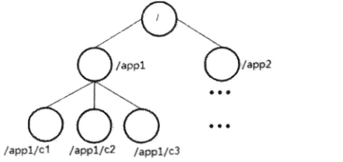
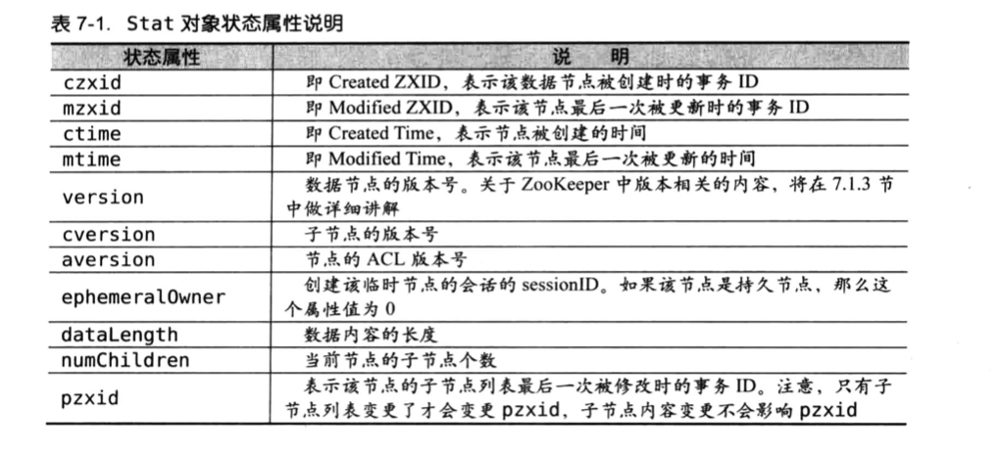
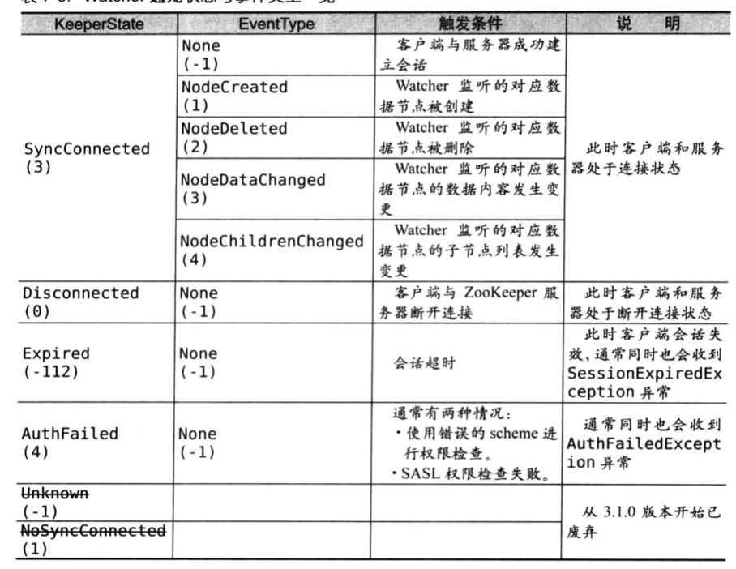

# 系统模型
数据模型，节点特性，版本，Watcher，ACL

## 数据模型
ZNode,形成的结构化的命名空间，称之为树。

  

事务id：在zookeeper事务指的是可以改变状态的操作。会分配事务id——ZXID，64位。

## 节点特性
### 节点类型
节点分为：持久节点——persistent，临时节点——ephemeral，顺序节点——sequential。可以组合：

* 持久节点
* 持久顺序节点
* 临时节点——临时节点只能作为叶子节点
* 临时顺序节点

### 状态信息
get命令可以获取状态信息，保存在Stat。

## 版本
zookeeper中的版本和传统意义上的版本有区别。它表示的是修改次数。  
乐观锁可以用version做写入校验

## Watcher
主要包含客户端线程，客户端WatcherManager和zookeeper服务器三部分。  
wather通知状态与事件一览  

注意：
1、NodeDataChanged，即使数据变更内容一样，也会触发这个事件。  
2、NodeChildrenChanged，子节点数量和组成变更。子节点内容变更不会触发。
3、AuthFailed，指的是授权失败。

### 回调方法  
只是单纯的通知，不传数据，需要自己再去获取。
### 工作机制
客户端注册Watcher，服务端处理Wather和客户端回调watcher

## ACL
和linux的acl有一些区别，可以从三个方面理解：权限模式——Scheme，授权对象——id和权限——Permission。通常使用“scheme：id：permission”来标识一个有效的ACl信息。
### 权限模式
用来确定权限验证过程中使用的检验策略。使用最多的四种：
* IP
* Digest——类似于username：password
* world——最开放的权限控制，一种特殊的Digest：“world：anynoe”
* Super——超级用户

### 授权对象：ID
指一个实体或用户，模式不同id类型不同。比如——IP：192.168.1.1
### 权限
五大类：create，delete，read，write，admin

### 权限扩展
插件

### super模式
创建了持久节点，客户端退出了，也不用这个节点了，且有acl，可以用super模式删除。

# 序列化与协议
Jute序列化组件。

# 客户端
## 核心组件
* Zookeeper实例：客户端入口
* ClientWatchManager：客户端Watcher管理器
* HostProvider：客户端地址列表管理器
* ClientCnxn：客户端核心线程，内部又包含两个线程，SendThread和EventThread。

启动大体分为3个步骤：  
1、设置默认的Wather  
2、设置Zookeeper服务器地址列表  
3、创建ClientCnxn  

## HostProvider
打散，组成循环列表  
可以自己扩展
动态列表

## ClinetCnxn
### Packet
内部定义的一个对协议层的封装，作为zookeeper请求响应的载体。
Packet有许多属性，传输时只序列化requestHeader，request，readonly  
核心队列：outgoingQueue，pendingQueue  

# 会话
客户端和服务器完成连接后，建立了一个会话。
## 会话状态 
大致可分为：connecting，connected，reconnecting，reconnecting，close，等等  
一般是介于connecting，connected两者之一。  

## 会话创建
*session*  会话实体，4个基本属性：  
sessionID：全局唯一  
TimeOut：  
TickTime：下次会话超时时间点，为了便于zookeeper对会话实行分桶策略  
isCloing：  

## 会话管理
分桶策略：  
zookeeper的会话管理主要是由SessionTracker负责的，采用了一种特殊的会话管理方式，我们称之为“分桶策略”。所谓分桶策略，是指将类似的会话放在同一区域块中进行管理，以便进行不同的区块隔离处理以及同一区块的统一处理。

分配原则：每个会话的“下次超时时间点”，  
ExpirationTime_=currentTime+SessionTimeout  
ExpirationTime = (ExpirationTime_/ExpirationInterval+1) * ExpirationInterval  

心跳检测过程称之为TouchSession  

## 重连
连接断开：connection_loss,捕获异常，等待重连，然后重新操作。  
会话失效：session_expried，重新建立连接
会话转移：session_moved，重新连上，只是是在另一台机子上重连

# 服务器启动
预启动  
QuorumPeerMain开始。  

单机模式委托——ZookeeperServerMain进行处理  

集群会初始化Leader选举，这是和单机版最大的区别。  

# Leader选举
三种选举算法，LeaderElection，udp的FastleaderElection和tcp版的FastLeaderElection,3.4.0版本废弃了前两种。  

先比zxid，一样的话，再比myid

# 各个服务器角色介绍
## leader
1、事务请求的唯一调度者和处理者，保证事务处理的顺序性。  
2、集群内部各个服务器的调度者。  

## follower
1、处理客户端非事务请求，转发事务请求给leader服务器。  
2、参与事务请求Proposal的投票。  
3、参与leader选举投票。  

## observer
3.3.0开始引进   
用在非事务处理上，提高性能  

## 集群间的消息通信
消息类型大体上分为：数据同步型、服务器初始化型、请求处理型、会话管理型。
**数据同步**   
类型：diff，trunc，snap，uptodate  

**服务器初始化型**   
observerinfo，followerinfo，leaderinfo，ackepoch，newleader，

**请求处理型**  
requeset，proposal，ack，commit，inform，sync

**会话管理型**  
ping，revalidate

# 请求处理
针对客户端的请求，是如何处理的。
## 会话创建请求
请求接收，会话创建，预处理，事务处理，事务应用和会话响应。

## 事务请求转发
follower，observe转发请求

## getdata请求

# 数据与存储
内存数据存储，磁盘数据存储
## 内存数据存储
定时存储到磁盘上。datatree是存储数据的核心。datanode是存储数据的最小单元。zkdatabase内存数据库，管理会话，dattree，事务日志。
## 事务日志
dataDir是默认用于存储事务日志的文件，也可以单独分配：dataLogDir

logFormatter，可以将日志转换成可视化的日志。  

日志预分配--》磁盘预分配，64m，避免磁盘Seek

## snapshot数据快照
和日志不同，没有预分配，可以反应当前使用的内存大小。
SnapshotFormatter可视化     

## 初始化
用于将磁盘数据加载到内存。

## 数据同步
