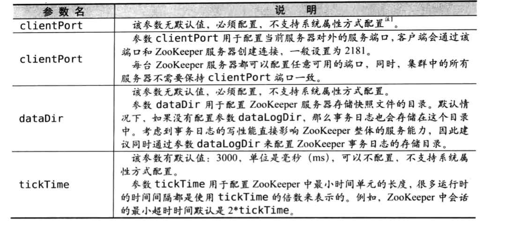

# 配置详解
## 基本配置

## 高级配置

## 四字命令
很多命令长度是4个英文字母，所以叫4字命令。  

## jmx

## 监控

## 数据统计

# 高可用集群
## 集群组成
2n+1
## 容灾
一个组件出问题，系统整体可用性下降或瘫痪，说明存在单点问题。  
三机房部署。三个机房部署若干机器。  
n1,1~(n-n1)/2,n-n1-n2  
双机房部署，没有较好的方案，最多一个部署多一些，一个部署少一些。

## 扩容和缩容
一种是集群整体重启，一种是逐台重启

# 日常运维
日志文件需要人工干预。

## too many connections
